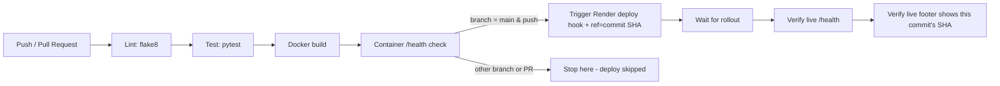

# Assignment Tracker — Academic Assignment Deadline Tracker

Assignment Tracker is a small dynamic web app for students to track assignment
deadlines: add an assignment with subject, name and due date, mark it
complete, delete it, and see pending vs. completed work at a glance.

Built for CCA 2 (Individual Submission) using Python, Flask, pytest,
flake8, Docker, GitHub Actions and Render.

## Features

- **Homepage** — dynamic dashboard rendered from server-side data, with
  summary cards (total / pending / completed) and a sortable list of
  assignments (soonest deadline first).
- **Add form** — `POST /add`, server-side validation (required fields,
  `YYYY-MM-DD` date format and a real calendar date).
- **Mark complete / delete** — `POST /complete/<id>` and
  `POST /delete/<id>`.
- **JSON API** — `GET /api/assignments` returns all assignments as JSON.
- **Health check** — `GET /health` returns `{"status": "ok"}`.
- **Commit ID footer** — reads Render's `RENDER_GIT_COMMIT` env var and
  shows the short commit hash in the page footer, falling back to
  `local-dev` outside Render.

## Tech stack

| Part | Tool |
| --- | --- |
| Language | Python 3.12 |
| Web framework | Flask |
| Templates | Jinja2 |
| Tests | pytest |
| Linting | flake8 |
| Container | Docker |
| CI/CD | GitHub Actions |
| Hosting | Render |

## Local setup

```bash
git clone https://github.com/<your-username>/assignment-tracker.git
cd assignment-tracker

python3 -m venv venv
source venv/bin/activate        # on Windows: venv\Scripts\activate

pip install -r requirements.txt

# run the app
python app.py                   # visit http://localhost:5000

# lint
flake8 .

# tests
pytest -v
```

## Running with Docker

```bash
docker build -t assignment-tracker .
docker run -p 5000:5000 assignment-tracker
curl http://localhost:5000/health
```

## CI/CD pipeline

The pipeline lives at `.github/workflows/ci-cd.yml` and runs on every
push and pull request. Deployment only happens on `main`, and only
after lint, tests and the Docker health check all pass.



If lint or tests fail, the `docker-build` and `deploy` jobs never run —
a broken commit cannot reach the live site. The deploy step passes
`&ref=<commit SHA>` to Render's deploy hook so it releases exactly the
commit that passed CI (not just "whatever is newest"), and the final
step re-fetches the live homepage and confirms that same short SHA
appears in the footer before the run is allowed to go green.

### Required GitHub Secrets

Set these under **Settings → Secrets and variables → Actions**:

| Secret | Value |
| --- | --- |
| `RENDER_DEPLOY_HOOK` | Render's deploy hook URL for this service |
| `RENDER_LIVE_URL` | The live app's base URL, e.g. `https://assignment-tracker.onrender.com` |

Never commit these values directly — they must only exist as secrets.

### Render setup

1. Create a new **Web Service** on Render from this repository.
2. Build command: `pip install -r requirements.txt`
   Start command: `gunicorn --bind 0.0.0.0:$PORT app:app`
3. Turn **off** Auto-Deploy in Render's settings, since deployment is
   triggered by the GitHub Actions pipeline instead, after checks pass.
4. Copy the service's deploy hook URL into the `RENDER_DEPLOY_HOOK`
   secret above.

## Project structure

```
AssignmentTracker/
├── app.py
├── requirements.txt
├── Dockerfile
├── .flake8
├── templates/
│   ├── base.html
│   └── index.html
├── static/
│   └── style.css
├── tests/
│   └── test_app.py
└── .github/workflows/ci-cd.yml
```

## Failure demonstration

To show the pipeline blocking a bad deploy: break an assertion in
`tests/test_app.py` on a feature branch, push it, and open the Actions
tab — the `lint-and-test` job fails and `docker-build`/`deploy` are
skipped. Fix the test, merge to `main`, and the full pipeline goes
green and deploys.
