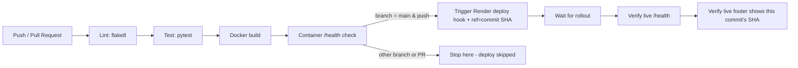

# Assignment Tracker — Academic Assignment Deadline Tracker

Assignment Tracker is a small dynamic web app for students to track assignment deadlines: add an assignment with subject, name and due date, mark it complete, delete it, and see pending vs. completed work at a glance.

Built for CCA 2 (Individual Submission) using Python, Flask, pytest, flake8, Docker, GitHub Actions and Render.

## Features

- **Homepage** — dynamic dashboard rendered from server-side data, with summary cards (total / pending / completed) and an assignment list sorted by status and due date.

- **Add form** — `POST /add`, server-side validation for required fields, character limits, valid `YYYY-MM-DD` dates, past dates, and duplicate assignments.

- **Mark complete / delete** — `POST /complete/<id>` and `POST /delete/<id>`.

- **JSON API** — `GET /api/assignments` returns all assignments as JSON.

- **Health check** — `GET /health` returns `{"status": "ok"}`.

- **Commit ID footer** — reads Render's `RENDER_GIT_COMMIT` environment variable and shows the short commit hash in the page footer, falling back to `local-dev` outside Render.

## Tech Stack

| Part | Tool |
| --- | --- |
| Language | Python 3.12 |
| Web framework | Flask |
| Templates | Jinja2 |
| Tests | pytest |
| Linting | flake8 |
| Container | Docker |
| CI/CD | GitHub Actions |
| Hosting | Render |

## Local Setup

Clone the repository:

```bash
git clone https://github.com/gayatri831/assignment-tracker.git
cd assignment-tracker
```

Create and activate a virtual environment.

### Windows

```powershell
python -m venv venv
venv\Scripts\activate
```

### Linux / macOS

```bash
python3 -m venv venv
source venv/bin/activate
```

Install dependencies:

```bash
pip install -r requirements.txt
```

Run the application:

```bash
python app.py
```

Visit:

```text
http://localhost:5000
```

Run linting:

```bash
python -m flake8 .
```

Run tests:

```bash
python -m pytest -v
```

## Running with Docker

Build the Docker image:

```bash
docker build -t assignment-tracker .
```

Run the container:

```bash
docker run -p 5000:5000 assignment-tracker
```

Health check:

```bash
curl http://localhost:5000/health
```

Expected response:

```json
{
  "status": "ok"
}
```

## CI/CD Pipeline

The pipeline lives at `.github/workflows/ci-cd.yml` and runs on every push and pull request.

Deployment only happens on `main`, and only after lint, tests and the Docker health check all pass.



The pipeline performs the following checks:

1. **Linting** using flake8.
2. **Automated testing** using pytest.
3. **Docker image build** to verify the application can be containerized.
4. **Container health check** using the `/health` endpoint.
5. **Deployment to Render** only for successful pushes to `main`.
6. **Deployment verification** by checking the live `/health` endpoint.
7. **Commit verification** by confirming that the live footer contains the same commit SHA that passed CI.

If lint or tests fail, the `docker-build` and `deploy` jobs do not run. This prevents a broken commit from reaching the live site.

The deploy step passes the commit SHA to Render's deploy hook so that the deployment corresponds to the commit that passed CI, rather than simply deploying an unrelated newer commit.

The final verification step re-fetches the live homepage and confirms that the same short commit SHA appears in the footer before the workflow is considered successful.

## Required GitHub Secrets

Set these under:

**Settings → Secrets and variables → Actions**

| Secret | Value |
| --- | --- |
| `RENDER_DEPLOY_HOOK` | Render's deploy hook URL for this service |
| `RENDER_LIVE_URL` | The live application's base URL |

Never commit secret values directly to the repository. They must only exist as GitHub Actions secrets.

## Render Setup

The application is deployed on Render using the project's Docker configuration.

1. Create a new **Web Service** on Render from this GitHub repository.
2. Configure the service to use the project's `Dockerfile`.
3. Turn **off** Auto-Deploy in Render's settings because deployment is triggered by the GitHub Actions pipeline after all checks pass.
4. Copy the service's deploy hook URL into the `RENDER_DEPLOY_HOOK` GitHub secret.
5. Store the live application URL in the `RENDER_LIVE_URL` GitHub secret.
6. The deployed application exposes the `/health` endpoint for deployment verification.
7. The homepage footer displays the short Render commit ID so the deployed version can be verified against the GitHub Actions run.

## Project Structure

```text
AssignmentTracker/
├── app.py
├── requirements.txt
├── Dockerfile
├── .flake8
├── templates/
│   ├── base.html
│   └── index.html
├── static/
│   └── style.css
├── tests/
│   └── test_app.py
└── .github/
    └── workflows/
        └── ci-cd.yml
```

## Failure Demonstration

To demonstrate that the CI/CD pipeline blocks a bad deployment:

1. Create a feature branch.
2. Intentionally break an assertion in `tests/test_app.py`.
3. Push the branch to GitHub.
4. Open the **Actions** tab and show that the `lint-and-test` job fails.
5. Show that the Docker build and deployment jobs are skipped.
6. Capture a screenshot of the red workflow.
7. Fix the broken test.
8. Push the corrected code.
9. Merge the corrected branch into `main`.
10. Verify that the full pipeline becomes green and the corrected version is deployed.

This demonstrates that a failing test prevents the application from being deployed.

## Validation Rules

The application validates assignment data before saving it.

- Subject is required and limited to 60 characters.
- Assignment name is required and limited to 100 characters.
- Due date is required.
- Due date must use the `YYYY-MM-DD` format.
- Due date must be a real calendar date.
- Past due dates are rejected.
- Duplicate assignments with the same subject and assignment name are rejected.
- Duplicate checking is case-insensitive.

## API Endpoints

### Health Check

`GET /health`

Returns the health status of the application.

Response:

```json
{
  "status": "ok"
}
```

### Assignments API

`GET /api/assignments`

Returns all assignments in JSON format.

Example:

```json
[
  {
    "id": 1,
    "subject": "DBMS",
    "name": "Assignment 1",
    "due_date": "2026-10-15",
    "completed": false
  }
]
```

## Git Workflow

The project uses GitHub for version control.

Development changes are made through meaningful commits, with feature or documentation changes maintained separately when required.

The project also uses branches and pull requests to demonstrate the Git workflow. Changes can be reviewed in a branch before being merged into `main`.

## Deployment Verification

After a successful deployment:

- The live application URL is checked.
- The `/health` endpoint returns `{"status": "ok"}`.
- The homepage loads successfully.
- The assignment form works.
- The live footer displays the deployed commit ID.
- The displayed commit ID is compared with the successful GitHub Actions run.

## CCA 2 Submission Evidence

The project submission should include evidence of:

- Public GitHub repository.
- Meaningful commit history.
- Git branches and at least one merged pull request.
- Passing automated tests.
- Passing flake8 linting.
- Successful Docker build and health check.
- One successful GitHub Actions run.
- One intentionally failed GitHub Actions run.
- Live Render deployment.
- Live commit ID matching the successful deployment run.
- README documentation.
- PDF report with screenshots and relevant links.